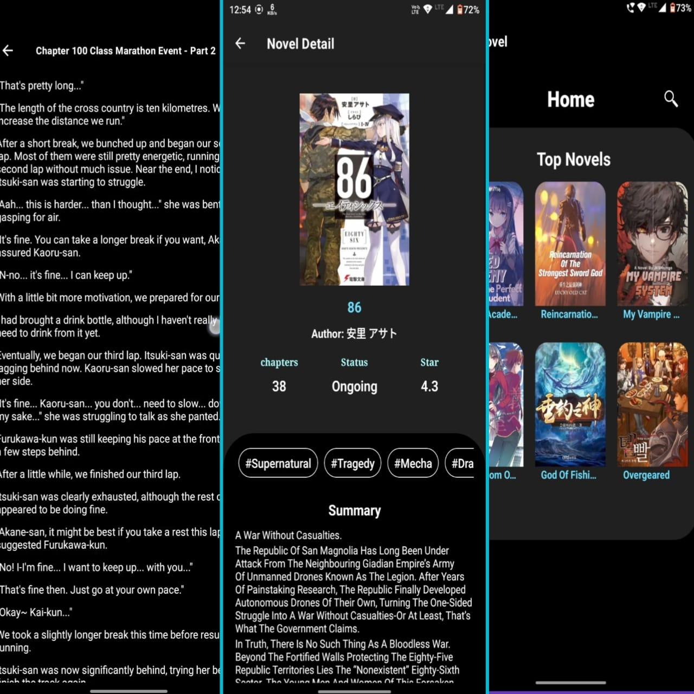

# Webnovel Reading App

Welcome to the Webnovel Reading App! This app allows you to read almost every webnovel available online, save your reading history, and automatically keep track of the last chapter you read.

## For Developers

To get started with development:

1. Use `npm install` to install all dependencies.
2. Run the app locally using `npm run start`.

## For Users

To start using the app:

1. Download the app from the [Releases](https://github.com/Ayushsinha106/webNovelExpo/releases/tag/apk) tab.
2. Install and open the app to begin reading your favorite webnovels.

## Features

- **Wide Novel Selection**: Access to almost every webnovel available online.
- **Reading History**: Save your recently read novels in a dedicated tab.
- **Automatic Bookmarking**: The app automatically saves your last read chapter, so you can pick up right where you left off.

---
## Interface

Enjoy your reading experience!
